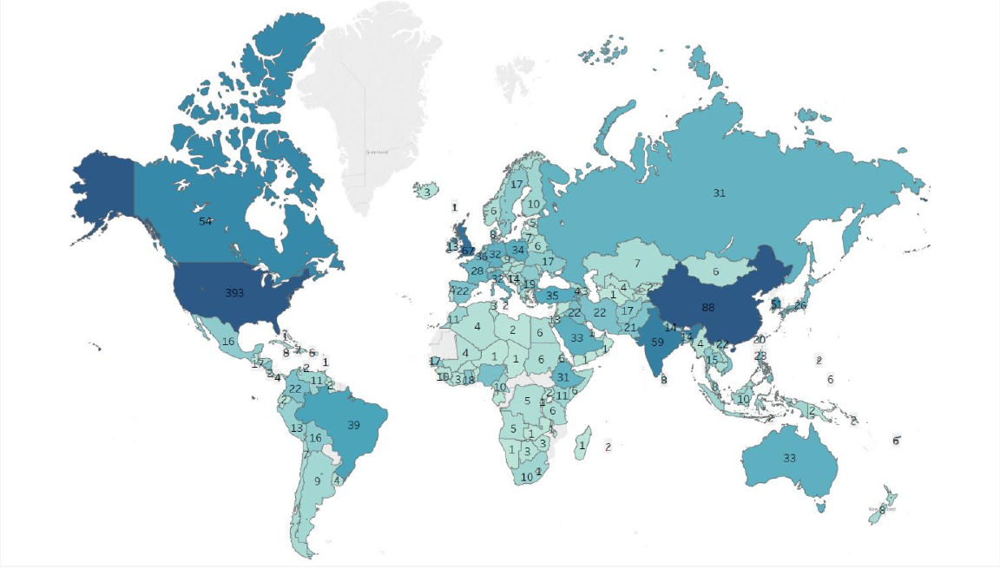
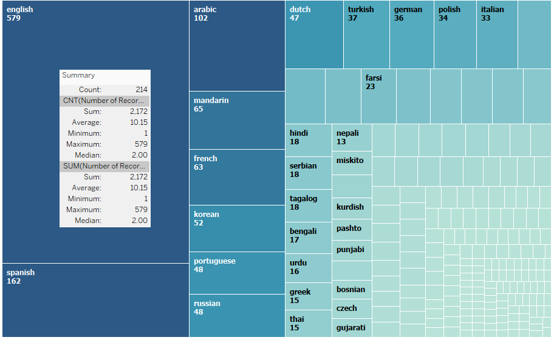
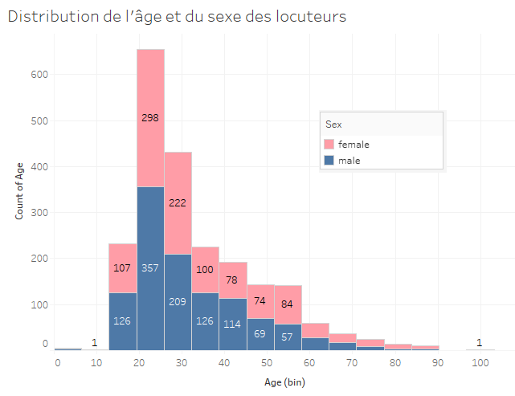
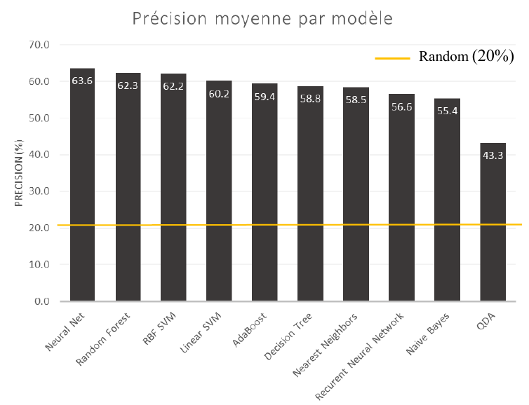
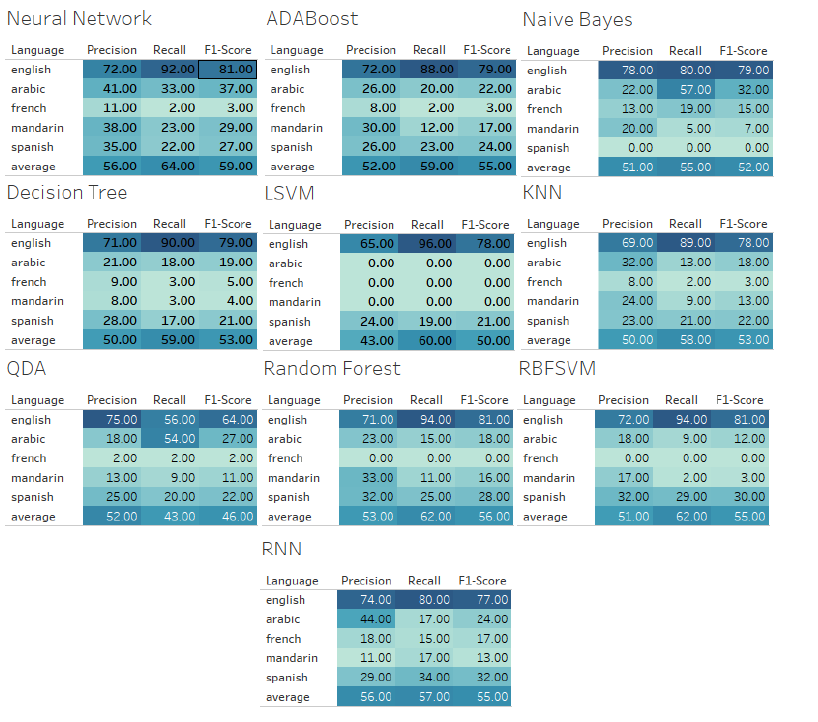
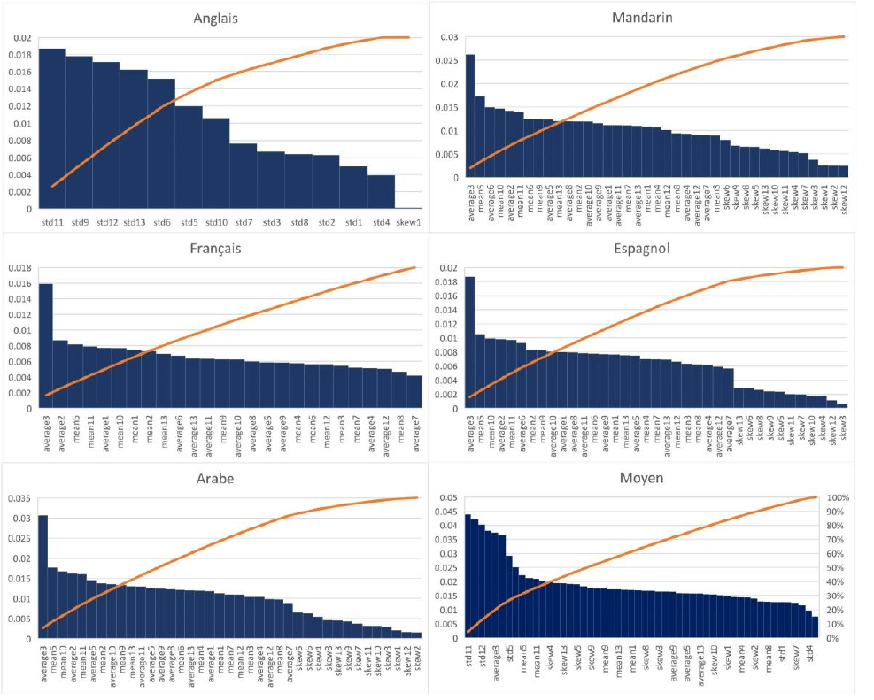

<h1> Reconnaissance automatique de la langue maternelle d’un individu par l’analyse de son accent </h1>
_Jérémie Piotte  
Département de génie logiciel et des 
technologies de l'information  
École de Technologie Supérieure  
Montréal, Canada  
jeremie.piotte.1@ens.etsmtl.ca_  

## I. INTRODUCTION

Cet article présente les impacts et les différentes méthodes
d’apprentissage machine pour la reconnaissance automatique
de la langue maternelle d’un locuteur accentué. Bien que la
reconnaissance et la compréhension de la voix humaine soient
d’anciens domaines d’études, ils ont été développés de manière
considérable au cours des dernières années, particulièrement en
intelligence artificielle. Toutefois, malgré les nombreux
avancements, certains problèmes sont complexes et persistent,
notamment l’adaptation du système de reconnaissance vocale à
l’accent du locuteur. Cet article vise à proposer une nouvelle
approche permettant de contribuer à la résolution de ce
problème par l’usage de science de la donnée. Dans l’article
suivant, l’accent sera mis sur l’extraction des variables les plus
significatives pour la reconnaissance de la langue maternelle
d’un individu. Nous présenterons plusieurs méthodes
permettant d’y arriver tout en présentant les résultats des
différents algorithmes utilisés.

## II. CONTEXTE

L’un des domaines d’application de cette recherche est
l’adaptation du système de reconnaissance vocale à l’accent de
l’utilisateur, autant pour mieux comprendre la syntaxe que la
sémantique de son discours. La proposition est de d’abord être
en mesure de classifier l’origine de l’accent de l’utilisateur
pour ensuite adapter l’analyse de la voix en conséquence. La
plupart des gens ayant une langue maternelle autre que celle
utilisée pour s’exprimer utilisent des expressions issues de leur
langue maternelle, qui peuvent influencer la sémantique de la
phrase. En connaissant la langue maternelle, il serait possible
de diminuer les ambiguïtés d’une phrase donnée en choisissant
les interprétations se rapprochant de la grammaire associée à
langue maternelle de l’individu.

Une autre approche serait d’ajuster la bande sonore d’un
discours accentué vers un son plus traditionnel pour que celui-
ci puisse ensuite être analysé par le système de reconnaissance
vocale. Avec la méthode d’analyse proposée dans ce papier,
nous pouvons identifier les différentes variables les plus
significatives pour la reconnaissance d’un accent et d’utiliser
ces valeurs pour ajuster la bande sonore. L’avantage de cette
approche est la diminution de l’ambiguïté lexicale et
syntaxique d’un discours ainsi que d’offrir la possibilité de
modifier l’accent perçut par les auditeurs. Autrement dit, la
possibilité de modifier ou de substituer son accent à l’aide d’un
système intelligent. Une application intéressante pour les
acteurs, les locuteurs non natifs d’une langue, enseignants,
étudiants, linguistes, etc.

## III. OBJECTIFS

Les principaux objectifs de cette recherche sont les
suivants:

1. Déterminer l'emplacement géographique ou la langue
   maternelle d'un locuteur par l’analyse de son accent.
2. Cibler les variables les plus significatives permettant
   de reconnaître un accent.

Le premier objectif est subdivisible en plusieurs sous-
objectifs, soient :

a) Déterminer les différentes classes de sortie. Plusieurs
langues maternelles dans l’ensemble de données n’ont
pas suffisamment d’échantillons pour les analyser
convenablement. Il sera donc nécessaire de mettre en
commun plusieurs d’entre elles ou encore d’analyser
seulement les langues les plus communes.

b) Bâtir un ensemble de données qui pourra être analysé
par différents modèles d’apprentissage machine. Ce
qui implique de convertir les fichiers mp3 en valeurs
numériques.

c) Cibler le modèle d’apprentissage machine ayant le
plus haut taux de précision et de rappel.

d) Visualiser les résultats de façon à représenter la
catégorisation des échantillons.

Pour le second objectif, il sera nécessaire d’offrir
différentes figures permettant de comparer facilement le poids,
effet et relevance de chaque variable de l’ensemble de données.
Il faudra être en mesure d’expliquer la raison pour laquelle ces
variables sont en effet les plus significatives pour déterminer la
langue maternelle d’un individu.

## IV. MATÉRIEL

Les données permettant de mettre en œuvre ce projet
proviennent du « Speech Accent Archive » de
[http://accent.gmu.edu.](http://accent.gmu.edu.) Cet ensemble de données contient 2140
échantillons de parole, chacun d'un locuteur différent lisant le
même passage de lecture. Les locuteurs proviennent de 177
pays, on y retrouve 214 langues natives différentes et chaque
personne parle en anglais.

L’ensemble de données contient les informations suivantes
pour chaque échantillon : âge, âge d’adoption de l’anglais, lieu
de naissance, fichier audio, langue maternelle, sexe, et pays de
naissance. Les fichiers audios sont au format MP3 et ont une
durée variable allant de 20 à 40 secondes chacun. Chaque
locuteur lit le texte anglophone suivant :

« Please call Stella. Ask her to bring these things with her
from the store: Six spoons of fresh snow peas, five thick slabs
of blue cheese, and maybe a snack for her brother Bob. We
also need a small plastic snake and a big toy frog for the kids.
She can scoop these things into three red bags, and we will go
meet her Wednesday at the train station. »

Le figure 1 ci-dessous illustre le pays de naissance des
différents locuteurs de l'ensemble de données. Nous avons une
couverture de plus de 95% des pays de la planète. Cependant,
nous avons un nombre insuffisant d'échantillons dans plusieurs
régions pour en faire une analyse concluante.

*Figure 1 : Distribution géographique des locuteurs par lieu de naissance*

La figure 2 suivante illustre la répartition de la langue
maternelle des différents locuteurs. Bien que le jeu de données
nous offre 214 langues natives déférentes, la majorité des
langues sont en nombre insuffisant. Il sera donc nécessaire de
les agréger ou encore d’éliminer les langues en nombre
insuffisant pour l’analyse.

*Figure 2 : Répartition de la langue maternelle des différents locuteurs*

La figure 3 suivante démontre que le jeu de données
contient une répartition égale d’homme et de femmes pour
chaque tranche d’âge. Ce qui nous permet d’avoir une analyse
non biaisée quant aux fréquences qui pourraient être associées
au sexe de l’individu plutôt qu'à son type accent.

*Figure 3 : Distribution de l'âge et du sexe des locuteurs*

## V. MÉTHODES

Dans cette section, nous décrirons les méthodes et moyens
utilisés pour répondre aux objectifs préalablement établis. Les
méthodes seront subdivisées en trois catégories, soient le
prétraitement, la modélisation ainsi que la visualisation des
résultats.

A. Le prétraitement
Puisque les données à analyser sont au format MP3, il
sera nécessaire de faire une série de traitement pour
construire un jeu de données de valeurs numériques.
Voici les différentes tâches qui ont été effectuées :

1. Convertir les fichiers mp3 en format « wav »
   (Waveform Audio File Format) étant donné qu'il s'agit
   d'un format universel et moins compressé, il est mieux
   adapté pour le traitement de fichiers audios. Puisque
   la fréquence d'échantillonnage d’un fichier au format
   « wav » est fixée à 44100 échantillons / s, cela nous
   donne un vecteur d’une dimension de près de 1
   million de valeurs pour un échantillon d’environ 30
   secondes.

2. Standardiser les fichiers. Puisque chaque
   instance de discours a une durée différente, les
   rendant incomparables, il est nécessaire de les ajuster
   pour qu’ils aient tous une durée standard. Afin de
   minimiser l’impact de la modification, nous avons
   choisi d’ajuster la durée de chacun des fichiers audios
   à la durée moyenne, soit ~30 secondes.

3. Conversion en valeurs numériques. Pour
   mettre en valeur les fichiers audios, des « Mel
   Frequency Cepstral Coefficients » (MFCC) ont étés
   utilisés. Une technique âgée de plusieurs décennies
   pour représenter, en valeurs numériques, le discours
   humain tel qu'il est perçu. Il existe un total de 26
   coefficients pour l’analyse du son. Pour l’analyse de
   la voix humaine, seule les coefficients 2 à 13 sont
   nécessaires puisque les autres ne sont pas perceptibles
   par l’oreille humaine et sont de fait qu’un superflu.

4. Extraire les variables. Puisqu’une valeur de
   coefficient est calculée pour chaque fréquence
   d'échantillonnage, soit 44100 par secondes, nous
   avons plusieurs millions de valeurs pour chaque
   coefficient. Il faudra alors calculer plusieurs indices
   statistiques afin de les représenter de la meilleure
   façon qu’il soit. Ces valeurs deviendront les «
   features » utilisés pour l’analyse. Nous avons choisi
   d’utiliser la moyenne, la médiane, l'écart-type ainsi
   que l’indice d’asymétrie (skewness) pour chaque
   coefficient.

B. Modélisation
Différents modèles d’apprentissage machine seront
utilisés afin de modéliser l’ensemble de données. Il est
avantageux de pouvoir comparer les différents résultats
pour ainsi pouvoir cibler le modèle le plus avantageux
selon les besoins.

Voici les algorithmes utilisés :

1. « Adaptative Boosting » (AdaBoost)
2. « Decision Tree Classifier »
3. « K-Nearest Neighbors » (KNN)
4. « Linear Support Vector Machine » (SVM)
5. « Naive Bayes classifier »
6. « Neural Network »
7. « Random Forest »
8. « Quadratic Discriminant Analysis » (QDA)
9. « Radial Basis Function Support Vector Machine » (RBF SVM)
10. « Recurrent Neural Network » (RNN)

C. Visualisation
Les outils de visualisation utilisés sont les suivants :

- La librairie graphique python : plot.ly.
- Le logiciel « Tableau » de ©TABLEAU SOFTWARE.

Nous illustrerons autant les métadonnées que les
résultats de l’analyse. Nous nous efforcerons d’utiliser
le type de graphique le mieux adapté à chaque situation.
Cependant, afin de conserver un certain standard, nous
allons nous concentrer sur les types de graphiques
suivants : « treemap », « heatmap », map monde,
diagrammes à bandes, matrices de confusion.

## VI. RÉSULTATS

L’un des premiers objectifs était de déterminer les
différentes classes de sortie. Parmi les 214 langues présentes
dans l’ensemble de données, seules 5 étaient en quantité
suffisante pour une analyse en profondeur permettant de fonder
des conclusions pertinentes. Nous avons donc choisi ces cinq
dernières pour notre analyse, soient l’anglais, l’espagnol,
l’arabe, le mandarin et le français. Pour une telle quantité de
classes de sortie, le seuil de précision à dépasser afin de vaincre
une classification aléatoire est 1/5, soit 20%. Bien que notre
ensemble de données soit limité, nous avons réussi à obtenir
des résultats hautement convaincants. Ceux-ci dépassent
largement le seuil aléatoire, ce qui rend nos données
amplement valides pour une analyse.

La figure 4 ci-dessous illustre le niveau de précision moyen
de chacun des modèles d’apprentissage machine préalablement
choisis. Le réseau de neurones récurrent (RNN) est l’une des
formes d’apprentissage profond les plus utilisées dans le
domaine de la reconnaissance vocale. Généralement, s’il est
alimenté avec un très grand volume d’échantillons, cette
approche surpasse considérablement ses compétiteurs.
Cependant, nous n’avions pas un assez vaste éventail de
données pour en faire bon usage. Le gagnant de cette catégorie
est le simple réseau de neurones à 32 couches cachées. Celui-
ci permet une précision moyenne de 63.6%, soit plus de trois
fois le seuil aléatoire de 20%. Bien que la précision soit une
mesure importante, elle ne permet pas de tirer de conclusion
immédiate. Il sera donc nécessaire d’analyser davantage les
statistiques de classification de chaque modèle avant d’élire le
mieux adapté.

*Figure 4 : Précision moyenne par modèle*

Le figure 5 suivante permet de visualiser plus en détail les
statistiques de classification de chaque algorithme. Il nous
permet de visualiser le degré de précision, de rappel ainsi que
le score F1 pour chaque langue. Le score-F1 harmonise le
score de précision et de rappel pour former une valeur
optimisant leur représentation.

Cette visualisation nous permet de constater que le score de
classification varie considérablement entre les diverses langues
maternelles. Notamment, les locuteurs français sont classifiés
convenablement moins fréquemment que les autres. Il faut
cependant noter que la quantité d’échantillons de locuteur
français est la plus faible parmi les cinq. Nous avons 579
échantillons anglophones et uniquement 63 francophones, ce
qui peut en partie expliquer pourquoi le score pour l’anglais est
aussi élevé par rapport aux autres.

Pour ce qui est du meilleur modèle, le meilleur score général
revient encore une fois au réseau de neurones. Cependant, le
modèle bayésien naïf ainsi que le « RNN » ont un score
remarquablement plus élevé que les autres pour la
classification du français. Une combinaison pourrait être
envisageable afin d’optimiser le score.

*Figure 5 : Statistiques de classification pour chaque modèle*

La matrice de confusion est une technique utilisée en
apprentissage supervisé pour mesurer la qualité d'un système
de classification. Chaque colonne de la matrice représente le
nombre d'occurrences d'une classe prédite, tandis que chaque
ligne représente le nombre d'occurrences d'une classe réelle (ou
de référence).

La matrice de confusion illustrée à la figure 6 suivante
représente les résultats du modèle le mieux adapté à nos
données, soit le réseau de neurones. On remarque que pour
toutes les catégories, on prédit significativement plus souvent
l’anglais que toute autre langue. Un effet probablement causé
par la quantité disproportionnée de locuteurs anglophones.

Toutefois, nous avons écouté les fichiers audios de
plusieurs locuteurs ayant été classifiés dans la mauvaise
catégorie. Ce qui nous a permis de constater qu’un accent
perçu n’est pas nécessairement associé à la langue maternelle
d’un individu. Par exemple, certaines personnes n’avaient
absolument aucun accent percevable, et ce même si leur langue
maternelle était autre que l’anglais. L’inverse est aussi vrai.
Par exemple, nous avions une personne anglophone qui a 
habité à Singapour toute sa vie. Une ville anglophone mais
donc l’accent local se rapproche de l’accent Mandarin. Le
réseau de neurones a alors classifié cette personne dans la
catégorie Mandarin. Cet effet cause une diminution
considérable du score de classification alors que cette personne
a effectivement un accent Mandarin. Ce comportement nous
remet en question concernant la corrélation entre la langue
maternelle d’un locuteur et son type d’accent.

*Figure 6: Matrice de confusion normalisée*

La figure 7 suivante contient des diagrammes de Pareto. Ce
type de figure est utile pour représenter l'importance de
différentes causes d'un phénomène. Ce diagramme permet de
mettre en évidence les causes les plus importantes sur le
nombre total d'effets. Étant donné que nous avons plus de 50
variables différentes, ce type d’illustration est la mieux adaptée
pour représenter les variables les plus discriminantes, tout en
allégeant le contenu.

Parmi les variables étudiées, nous avons la moyenne «
average », la médiane « mean », l’écart type « std » et l’indice
d’asymétrie « skew ». De plus, le chiffre suivant le nom de la
variable représente le numéro du coefficient MFCC.

Pour les locuteurs natifs anglophones, le réseau de neurones
nous indique que les variables les plus discriminantes, pour les
classifier avec succès, sont les écarts types des différents
coefficients. Dans le monde des MFCC, les déviations
standard représentent les intonations du locuteur. Le réseau de
neurones parvient alors à classifier les locuteurs anglophones
en analysant le niveau d’intonation dans leur discours.

Pour les autres, soit les locuteurs non natifs, on observe une
tout autre tendance. Les variables les plus discriminantes sont
en fait majoritairement les moyennes et les médianes des
différents coefficients. Une découverte intéressante puisque ce
sont les valeurs les plus malléables parmi ceux étudiés. Plus
précisément, la moyenne du discriminant 3 semble être
unanimement la variable la plus intéressante pour les locuteurs
non natifs.

*Figure 7 : Importance de chaque variable pour chaque langue*

## VII. DISCUSSION

Étant donné que la reconnaissance vocale a été grandement
étudiée dans les dernières années, il existe quelques études
scientifiques concernant l’analyse de l’accent de parole. Par
exemple, dans le papier « Determinants of English accents »
[ 2 ] de M. Wieling, on s’intéresse particulièrement sur les
métadonnées représentant le locuteur. Parmi ces métadonnées,
nous retrouvons l’âge, l’âge d’adoption de l’anglais, le niveau
d’éducation, le nombre de langues parlées ainsi que le pays de
résidence de l’individu. Les résultats de l’analyse ont indiqué
une corrélation entre l’accent du locuteur et l’âge d’adoption de
l’anglais. Cependant, l’étude n’était pas concluante pour les
autres variables, dues à la quantité insuffisante d’échantillons.

Une autre étude intéressante [ 3 ] sur le sujet se penche
plutôt sur la prononciation de chaque mot. Parmi leurs
découvertes, on apprend que les anglophones natifs utilisent
généralement la forme affaiblie d’un mot, tandis que les
francophones ne le font pas. En français, les voyelles non
accentuées ont tendance à être prononcées, et les locuteurs
français seraient peu susceptibles de produire la forme
affaiblie. Cette constatation vient rejoindre l’une des
découvertes de notre étude. Nous avons établi que les
variables les plus discriminantes pour classifier un locuteur
anglophone étaient reliées à son intonation.

Une troisième étude [ 1 ] s’intéresse plutôt à la différence
entre l’accent anglais américain et celui des Anglais
d’Angleterre. Les chercheurs ont utilisé un réseau de neurones
récurrent pour classifier les locuteurs. Ils ont réussi à obtenir
un niveau de précision de 61% en utilisant le même ensemble
de données que le nôtre. L’application visée de leur agent
intelligent est d’arriver à générer des fichiers audios qui
serviront à donner vie aux personnages non-joueurs (NPC)
dans les jeux vidéo.

## VII. CONCLUSION

Dans ce papier nous avons présenté une méthode
permettant de classifier les accents de discours de différents
locuteurs en fonction de leur langue maternelle. Nous avons
défini que le modèle d’apprentissage machine le mieux adapté
à nos données est le réseau de neurones avec un score-F1 de
64%, surpassant considérablement la populaire approche
d’apprentissage profond. Nous avons aussi illustré et ciblé les
différentes variables les plus discriminantes pour classifier
l’accent de chaque langue maternelle. Cependant, nous avons
aussi constaté qu’il n’y a pas toujours de corrélation entre la
langue maternelle d’un locuteur et son type d’accent. Afin
d’aller de l’avant avec le projet et poursuive vers la prochaine
étape, nous avons besoin d’un plus grand nombre
d’échantillons, particulièrement pour les autres langues que
l’anglais. Cette prochaine étape consiste à la réduction des
ambiguïtés d’un discours en utilisant la classification d’accents,
autant au niveau lexical que syntaxique et éventuellement
sémantique.

## IV. REMERCIEMENTS

Nous remercions Victor-Emmanuel Padel pour son expertise et
ses précieux conseils en multimédia et pour sa révision de la
version finale de ce document.
Nous remercions la professeur Sylvie Ratté pour nous avoir
orientés à plusieurs reprises. Notamment vers l’analyse du
discours par les « Mel Frequency Cepstral Coefficients »
(MFCC).

## X. RÉSUMÉ

Les systèmes de reconnaissance vocale étant utilisés dans
davantage d'applications et au vu du nombre important
d’accents, il est crucial que ces systèmes puissent gérer un
discours accentué. On le sait tous, souvent c’est un échec. Cet
article a pour objectif de démontrer qu’il est possible de
reconnaitre la langue maternelle d’un individu en analysant son
discours. On veut aussi démontrer qu’il est possible d’isoler les
variables les plus discriminantes permettant de reconnaitre un
accent. Ces deux démonstrations ouvrent la porte à une série
d’applications intéressantes. Notamment, l’ajustement d’un
discours accentué en fonctions des variables discriminantes
pour diminuer l’effet de l’accent, la génération de fichiers
audios offrant un accent désiré, l’ajustement de la grammaire à
celle de la langue maternelle du locuteur, diminution de
l’ambiguïté sémantique en reconnaissant les expressions mal
traduites, etc. Nous avons expérimenté 10 modèles
d’apprentissage machine allant d’un simple arbre de décision à
l’apprentissage profond (RNN). Nous avons réussi à détecter,
parmi les cinq langues les plus courantes que sont l'anglais,
l'espagnol, l'arabe, le mandarin et le français, la langue
maternelle d’un locuteur s’exprimant en anglais. Pour
accomplir cette tâche, le modèle de réseau de neurones à 32
couches cachées s’est avéré être le plus performant, offrant une
précision moyenne de 64% ainsi qu’un rappel allant jusqu’à
94% pour les locuteurs anglophones. Nous avons aussi réussi à
cibler les caractéristiques acoustiques les plus discriminantes
pour les cinq langues les plus courantes ainsi que leur niveau
de déviation par rapport au locuteur moyen. Ce qui finalement
ouvre la porte aux diverses applications d’un système de
classification d’accents, tout un univers de possibilités s’offre à
nous.

## XI. RÉFÉRENCES

[ 1 ] A. Ensslin, “Deep Learning for Speech Accent Detection in Videogames,”
The Language of Gaming, pp. 87–104, 2012.

[ 2 ] M. Wieling, K. Mignella, J. Nerbonne, J. Bloem, and M. Timmermeister,
“Measuring Foreign Accent Strength in English,” Language Dynamics and
Change, vol. 4, no. 2, pp. 253–269, Jan. 2014.

[ 3 ] G. Sivaraman, C. Espy-Wilson, and M. Wieling, “Analysis of Acoustic-to-
Articulatory Speech Inversion Across Different Accents and Languages,”
Interspeech 2017, 2017.

Le jeu de données contenant 2148 fichiers audios provient du
site web suivant : http://accent.gmu.edu/

Les algorithmes d’apprentissage machine proviennent de la
librairie python suivant :
http://scikit-learn.org/stable/index.html

La librairie permettant d’extraire les MFCC provenant des
milliers de fichiers audios du jeu de donnée est la suivante :
https://github.com/jameslyons/python_speech_features

## XII. ANNEXE

Le code qui a donné vie à cet article de recherche se trouve au
lien GitHub suivant :
https://github.com/piotte13/Speech-Accent-Mining
Le répertoire est public, n’hésitez pas à proposer des
améliorations ou encore des ajouts!